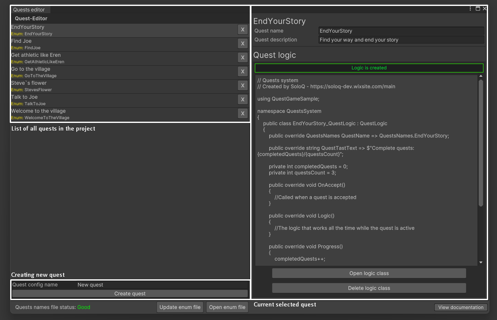

# First steps using the editor

****

## Open quests editor window
First, open an editor window:
<ol>
  <li>Find Utilities in the menu list</li>
  <li>Select Quests editor</li>
</ol>

## Window map


## How to work with the editor window
### Creating a new quest
<ol>
  <li>In the "New quest config name" field, write the name of the new quest</li>
  <li>Click create quest</li>
</ol>

### Quest editing
<ol>
  <li>Select the required quest</li>
  <li>Changing the name or description</li>
  <li>Click save</li>
</ol>

***Important!***: Autosave is missing due to changes in the FILES in the project!

## Quest logic
After creating a quest, you need to create the logic to complete it.

*Note: A quest can be added to the list of active quests and run without a logic file!*

### Creating logic
To create logic for your quest:
<ol>
  <li>Select the required quest</li>
  <li>Click Create logic class</li>
  <li>Wait for project compile</li>
</ol>

### Editing logic
In the updated window of the selected quest, click Open logic class.

Hello_QuestLogic.cs
```c#
        public override QuestsNames QuestName => QuestsNames.{QUEST_NAME};

        public override string QuestTastText => "TASK_TEXT";

        public override void OnAccept()
        {
            //Called when a quest is accepted
        }

        public override void Logic()
        {
            //The logic that works all the time while the quest is active
        }

        public override void Progress()
        {
            //Called when there is logic for progress (Call from any other entity)
        }

        public override void OnComplete()
        {
            //Called when a quest is completed
        }
```
You can implement any logic you want. You don't need to add this script anywhere.
The quest manager automatically takes the logic file from the config it needs.

The implementation example in the GameSample folder.
